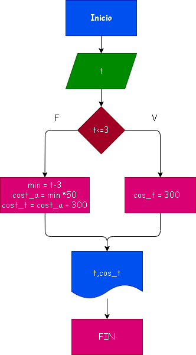

# Taller Ejercicio No. 1: Llamdas de telefono 

## Diagrama de flujo

# Analisis
t = tiempo de la llamda
m = t<= 3 minutos
la llamada cuesta $300 si es <= 3 minutos 
cuesta $50 mas por cada minuto adicional

