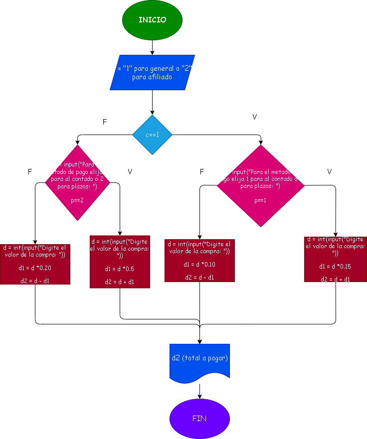

# Taller Ejercicio No. 9: Negocio y clientes

## Diagrama de flujo

# Analisis
Cliente general (G) y cliente afiliado (A)
Formas de pagos : contado (C) y en plazos (P)
monto del descuento o el monto del recargo y el total a pagar

